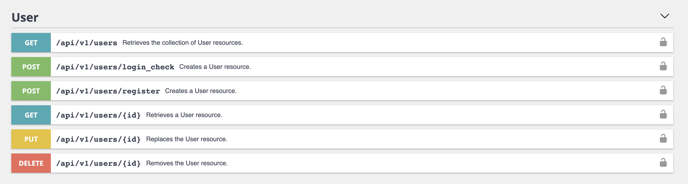

# Symfony 5 API + Docker Boilerplate

## What is this?
This is a boilerplate project which includes `Symfony 5.3`, and a `Docker configuration`.

It contains all the features needed to start building an API:
- Authentication system with Json Web Tokens (JWT) (https://github.com/lexik/LexikJWTAuthenticationBundle)
- Endpoints to manage users (register, get, update, change-password)
- Open API v3 documentation

- Fixtures for testing
- Unit tests
- Functional tests to cover the user endpoints use cases

## Usage /api
- `make build` to build the docker environment
- `make run` to spin up containers
- `make restart` to stop and start containers
- `make prepare` to install dependencies
- `make migrate-database` to run migrations
- `migrate-database-tests` to generate database for testing
- `load-fixtures-database-tests` to generate load fixtures for testing
- `make generate-ssh-keys` to generate JWT certificates
- `make ssh-be` to access the PHP container bash
- `make tests` to runt the test suite

## Usage /doc
- `make build` to build the docker environment
- `make run` to spin up containers
- Navigate to `http://localhost:2500/index.html` to check the Open API v3 documentation and testing endpoints
- `make restart` to stop and start containers

## Stack:
- `NGINX 1.19` container
- `PHP 8.0 FPM` container
- `MySQL 8.0` container + `volume`

## Contributing
Feel free to clone, fork or PR this repo

## License
This bundle is under the MIT license.
For the whole copyright, see the [LICENSE](LICENSE) file distributed with this source code.
